# **User Manual - Research Document Management System**

Research Document Management System เป็นระบบสำหรับจัดการเอกสารงานวิจัยของวิทยาลัยการคอมพิวเตอร์ โดยช่วยให้นักวิจัย, ผู้ใช้ทั่วไป, และบุคลากรทางการศึกษาเข้าถึงข้อมูลวิจัยที่เผยแพร่ต่าง ๆ ในระบบได้

## **การดูข้อมูลต่าง ๆ**

### **1. การดูข้อมูลผลงานวิจัยของนักวิจัยที่ต้องการ**
1. ผู้เข้าชมสามารถเข้าสู่หน้าเว็บไซต์ https://cssegroup6sec267.cpkkuhost.com/ โดยประกอบไปด้วย ผลรวมการตีพิมพ์แบ่งตามผู้เผยแพร่ กราฟสรุปผลการตีพิมพ์วิจัยทั้งหมดในวิทยาลัยการคอมพิวเตอร์ และผลงานแบ่งโดยปีที่ตีพิมพ์ เป็นต้น

2. ผู้เข้าชมสามารถเข้าชมโปรไฟล์นักวิจัย เมื่อกด Researchers มาแล้ว จะแสดงนักวิจัยทั้งหมด และสามารถเลือกหลักสูตรได้ ประกอบไปด้วย Computer Science, Information Technology, Geo-Informatics
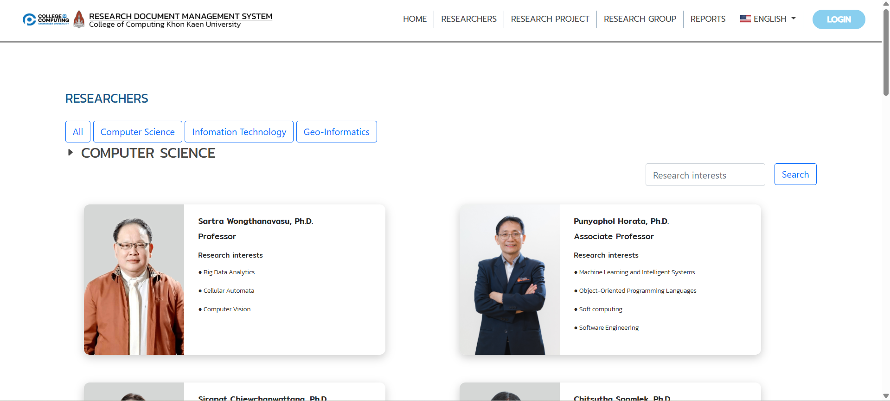

3. เลือกนักวิจัยที่ท่านต้องการดูข้อมูล เช่น **"Punyaphol Horata, Ph.D."**
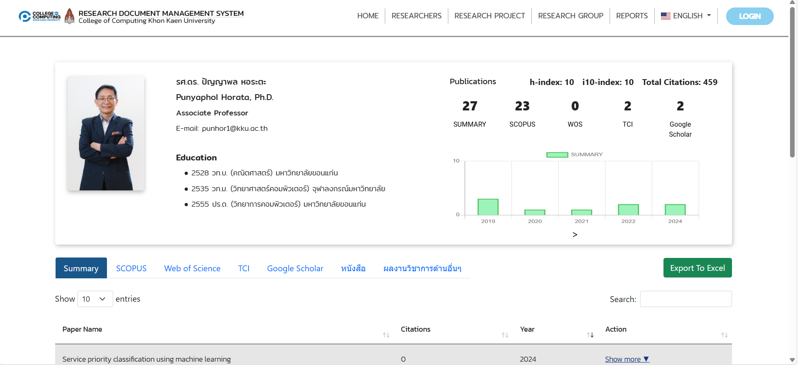

4. ระบบจะแสดงข้อมูลรายละเอียดเกี่ยวกับนักวิจัย กราฟแสดงสถิติการตีพิมพ์ กราฟแสดงสถิติการถูกอ้างอิงรายปี ผลรวมจำนวนการถูกอ้างอิง(**h-index**) ค่า **i10-index** ผลรวมสถิติการถูกอ้างอิงรายปี และผลงานวิจัยที่เกี่ยวข้อง 

### **2. การเลือกแหล่งข้อมูล**
1. ผู้ใช้สามารถเลือกแสดงข้อมูลผลงานวิจัยจากแหล่งต่าง ๆ ได้แก่ **Scopus**,**Web of Science**,**TCI**,**หนังสือ** และ **ผลงานวิชาการด้านอื่นๆ**
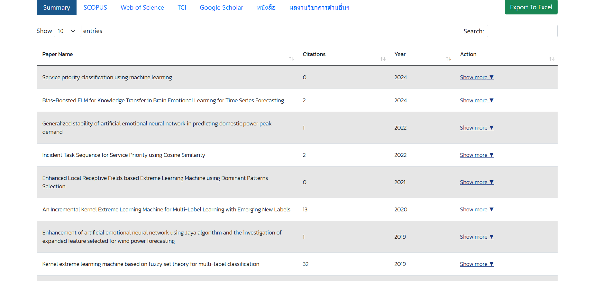
2. หากไม่เลือกแหล่งข้อมูล ระบบจะแสดงข้อมูลผลงานวิจัยทั้งหมดเป็นค่าเริ่มต้น (**Summary**)

### **3. การดูกราฟแสดงสถิติ**
1. ผู้ใช้งานสามารถดูกราฟแสดงสถิติเช่น **ผลรวมจำนวนการตีพิมพ์จากแหล่งต่าง ๆ (Publication)** 
และ **จำนวนการอ้างอิงทั้งหมด(Citation)** ของนักวิจัยแต่ละท่าน โดยในหน้าโปรไฟล์ของนักวิจัยเริ่มแรกจะแสดงแค่กราฟผลรวมจำนวนการตีพิมพ์จากแหล่งต่าง ๆ ซึ่งจะแสดงข้อมูลแค่  5 ปีล่าสุด
2. กดที่ชื่อของแหล่งข้อมูลบนกราฟเพื่อเลือกดูข้อมูลตามแหล่งนั้น ๆ
3. กดที่กราฟผลรวมจำนวนการตีพิมพ์จากแหล่งต่าง ๆ เพื่อดูข้อมูลของปีทั้งหมดที่มี เช่นกดที่ **SCOPUS**
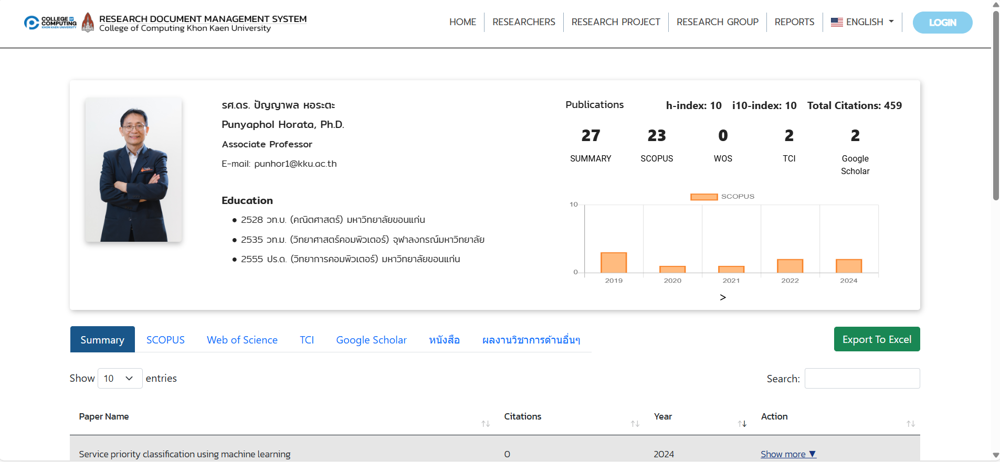
4. กดที่กราฟ **ผลรวมจำนวนการตีพิมพ์จากแหล่งต่าง ๆ (Publication)** เพื่อให้ข้อมูลในปีย้อนหลังทั้งหมดจะแสดงขึ้นมา
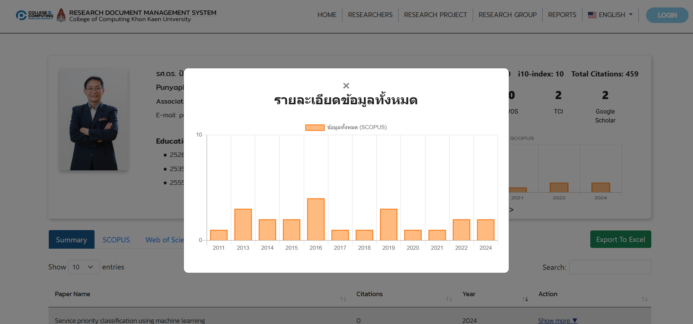 
5. กดที่ > ด้านล่างของ กราฟจำนวนการอ้างอิงทั้งหมด
6. กราฟ **จำนวนการอ้างอิงทั้งหมด(Citation)** ซึ่งแสดงข้อมูล 5ปีล่าสุด จะแสดงขึ้นมา
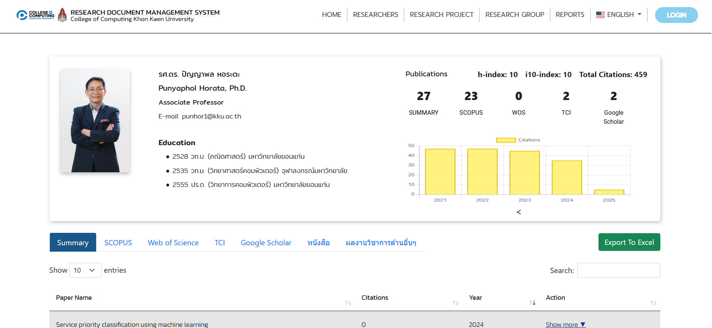
7. กดที่กราฟ **จำนวนการอ้างอิงทั้งหมด(Citation)** เพื่อให้ข้อมูลในปีย้อนหลังทั้งหมดจะแสดงขึ้นมา
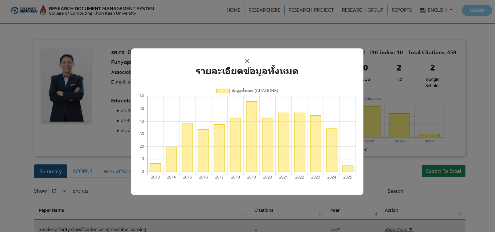

### **4. การดูรายละเอียดผลงานวิจัย**
1. เลือกผลงานวิจัยจากรายการ เช่น **"Service priority classification using machine learning"**
2. กด **Show more** เพื่อให้ระบบแสดงรายละเอียดผลงานวิจัย รวมถึงข้อมูลเพิ่มเติมที่เกี่ยวข้อง
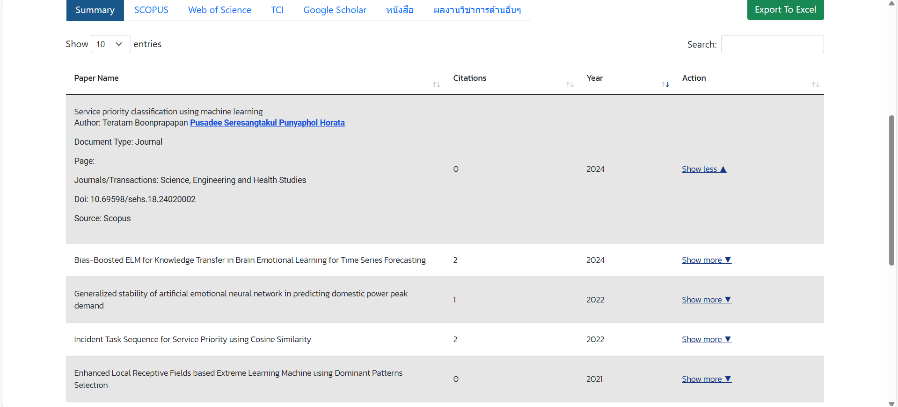

---

## **สำหรับนักวิจัย**

### **การเข้าสู่ระบบ (Login)**

### **1. ข้อมูลที่ใช้ในการเข้าสู่ระบบ**
- **Username:** ใช้ **KKU-Mail**
- **Password:** ใช้รหัสผ่านที่กำหนด  
- สำหรับนักศึกษาที่เข้าสู่ระบบเป็นครั้งแรก ให้ใช้ **รหัสนักศึกษา** เป็นรหัสผ่าน  
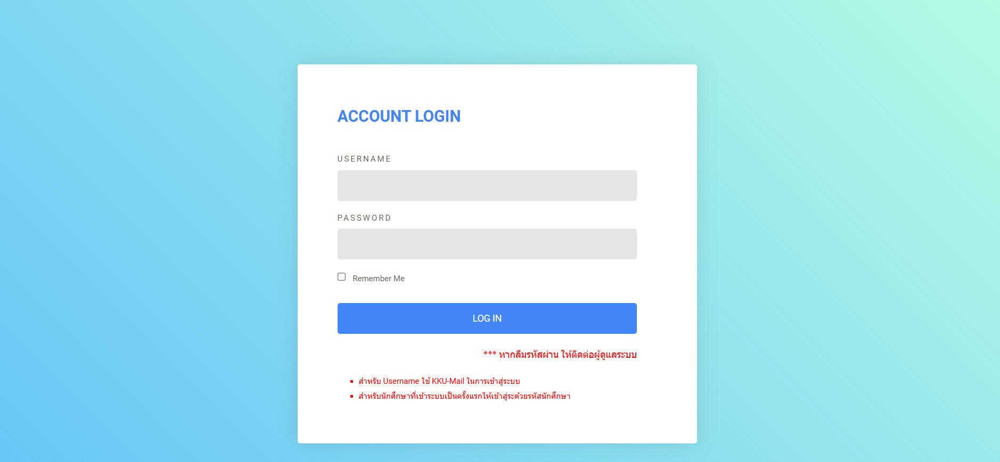

### **2. ขั้นตอนการเข้าสู่ระบบ**
1. ไปที่ [Research Document Management System](https://cssegroup6sec267.cpkkuhost.com/) 
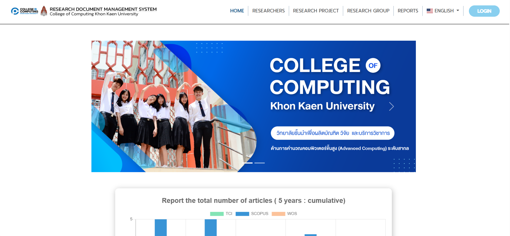
2. กดที่ Login ที่มุมขวาบนของหน้าเว็บ
3. กรอกข้อมูล:  
   - **Username:** ใส่ **KKU-Mail** ของท่าน
   - **Password:** ใส่รหัสผ่านที่กำหนด
4. (ตัวเลือก) หากต้องการให้ระบบจดจำข้อมูล คลิกที่ **"Remember Me"**  
5. คลิก **"Log In"**  
7. จะแสดงหน้า dashboard ของบัญชีนั้น แสดงว่าเข้าสู่ระบบสำเร็จ
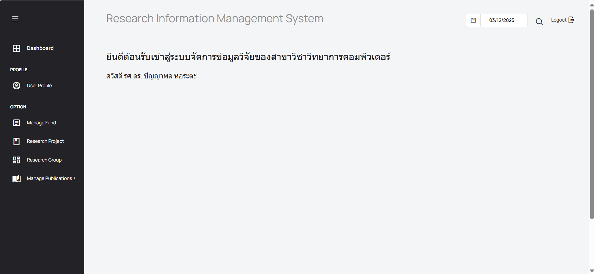

### **3. การออกจากระบบ (Log Out)**
1. เมื่อเสร็จสิ้นการใช้งานระบบแล้ว ผู้ใช้สามารถออกจากระบบได้โดยการคลิกที่ **"Log Out"** ที่มุมขวาบนของหน้าจอ
2. ระบบจะกลับไปที่หน้าเข้าสู่ระบบ

### **4. ลืมรหัสผ่าน**
หากลืมรหัสผ่าน **ให้ติดต่อผู้ดูแลระบบ** เพื่อขอรับการตั้งรหัสผ่านใหม่

## **การจัดการการตีพิมพ์จากแหล่งต่าง ๆ (Manage Publications)**
1. โดยกดที่เมนู Manage Publications -> Published research
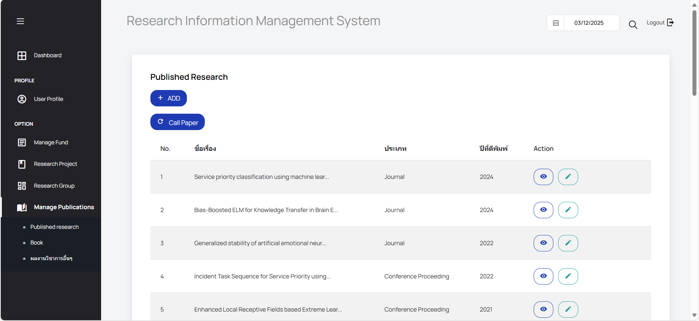
2. นักวิจัยสามารถเพิ่มงานวารสาร (Published research) โดยสามารถคลิกที่ **"Call Paper"** เพื่อเพิ่มงานวิจัยจากแหล่งต่าง ๆ ระหว่างที่โหลดจะแสดง Loading data..
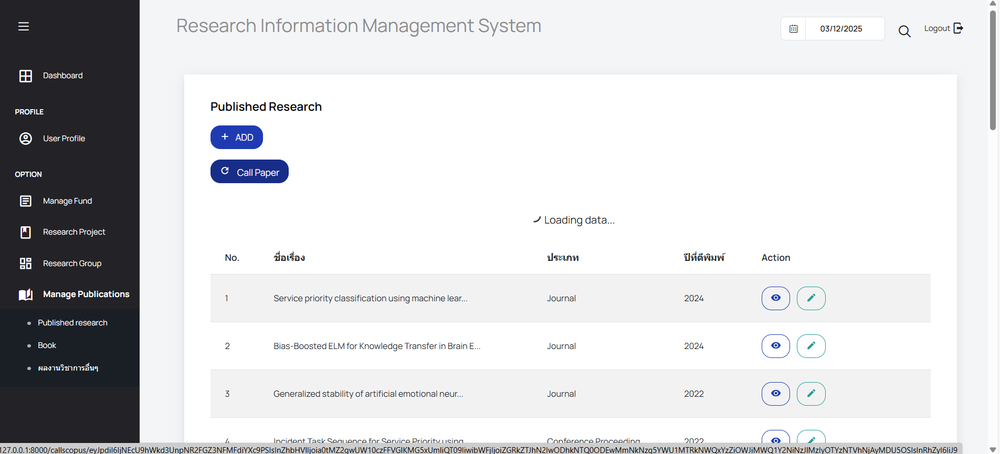
3. หาก Call paper สำเร็จ จะแสดงการแจ้งเตือน Success ให้กด Ok เพื่อดูงานวิจัยที่อัพเดตเข้ามา
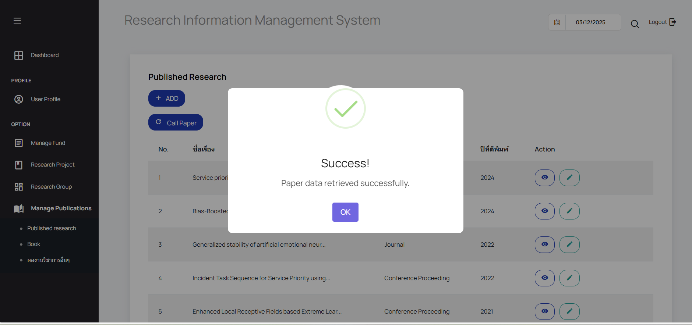
4. นักวิจัยสามารถดูงานวารสาร, หนังสือ และผลงานวิชาการอื่น ๆ ทั้งหมดที่มีการเพิ่มไว้ โดยคลิกที่ปุ่ม Action รูปตา เพื่อดูรายละเอียดของงานนั้น ๆ

---

**ข้อควรทราบ:**
- หากมีข้อสงสัยหรือพบปัญหาขณะใช้งาน โปรดติดต่อผู้ดูแลระบบเพื่อขอคำแนะนำและการช่วยเหลือเพิ่มเติม

Update : 12/03/2025
